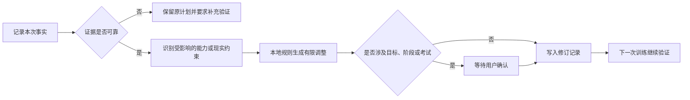

# IELTS AI Study Planner · 雅思学习手册

[在线演示](https://wuw039060-art.github.io/ielts-ai-study-planner/) · [安全与隐私说明](SECURITY.md)

**IELTS AI Study Planner** 是一个面向长期雅思备考和英语能力提升的个性化学习规划网站。它把学习计划、训练方法、阶段验收、进度复盘、状态管理和可选 AI 分析放在同一个系统里，帮助学习者根据真实证据持续调整接下来一年的安排。它不承担在线做题和题库分发，重点始终是回答“接下来为什么这样学、怎样学、何时才算有效”。

这个项目关注的不是用 AI 生成更多任务，而是让 AI 协助维护一份不会轻易失真的长期计划：当分数、错因、可用时间、执行情况和身心状态发生变化时，系统先判断证据是否可靠，再解释变化可能来自哪里，最后只调整真正受影响的近期安排。

## 项目初衷

这个项目来自一个很具体的问题：如果一个人准备拿出一年时间学习 IELTS，真正困难的往往不是找不到资料，而是资料太多、方法彼此重叠，长期计划又很容易被课程、实习、身体状态、情绪波动和一次偶然成绩打乱。

市面上的课程、词汇书、真题解析和经验总结各有擅长的部分。有的体系更会解释听力声音识别，有的更擅长阅读定位，有的强调写作论证，有的提供口语训练流程。但把所有资料从头学一遍并不会自然形成能力，反而容易把时间花在收集资源、研究方法和反复制定计划上。

因此，这个项目没有继续增加一套课程，而是尝试完成三件更基础的工作：

1. **提炼共同原理**：把不同体系中真正有效的部分还原为声音识别、意义处理、快速检索、受约束表达和反馈修正等可训练能力。
2. **建立个人路线**：根据学习者的基础、可用时间、目标分数和现实限制，决定当前最值得解决的问题，而不是照搬一份普通学生模板。
3. **让计划持续演化**：每次训练后只记录必要事实，通过可靠证据判断方法是否有效，再对近期任务进行有限调整；不因为一天状态差推翻长期目标，也不因为一次高分提前宣布完成。

它最终想解决的不是“今天去哪做题”，而是下面这个长期问题：

> 当个人能力、时间安排和外部情况不断变化时，怎样让一份学习计划仍然贴合真实需要，并一直陪伴学习者走到目标成绩。

## 为什么 AI 动态调整是核心

一份固定计划只能反映制定当天的判断，但雅思学习通常持续数月甚至一年。这个过程中，可用时间会因课程和工作变化，某些题型会比预期更难，写作与口语可能长期缺少可靠反馈，身体状态和压力也会影响一次训练结果。如果计划完全不变，它会逐渐脱离现实；如果每次遇到波动都重做计划，又会失去连续性。

AI 在这里最重要的价值，是帮助学习者处理这些分散、连续而且带有语境的信息。它可以把自然语言记录中的成绩、错因、感受和现实限制整理成结构化证据，比较近期记录是否出现重复模式，并说明某项变化更像能力问题、方法问题、时间不足还是短期状态波动。这样，学习者不必每次都从头分析整套计划，也不容易因为一次低分或一周拖延作出过度反应。

动态调整并不意味着让模型自由决定一切。本项目把职责分成三层：

1. **本地规则守住边界**：目标分数、阶段验收、红线和高风险决定不会被模型直接改写。
2. **AI 理解上下文**：AI 负责归纳记录、识别矛盾、发现重复模式，并在预设范围内提出有依据的调整建议。
3. **用户保留决定权**：涉及降级目标、跨阶段、报名考试或大幅改变学习路线时，必须由用户确认。

| 学习信号 | AI 动态分析的作用 | 最终形成的调整 |
| --- | --- | --- |
| 一次听力或阅读分数下降 | 区分偶然波动、题型陌生、计时问题与重复错因 | 先补一次同条件复测，证据不足时不改阶段 |
| 连续数周在同一能力上停滞 | 汇总错误记录和训练方法，寻找反复出现的瓶颈 | 每次只更换一个训练变量，再用未见材料验证 |
| 因拖延、课程或工作导致进度落后 | 比较原计划与真实可用时间，识别必须保留的任务 | 压缩近期任务，保留主攻、复测和最低接触，不追补全部欠账 |
| 状态差、压力大或睡眠不足 | 防止把短期状态误判为能力退步 | 先启用可逆的恢复安排，状态稳定后再判断成绩 |
| 学习者想增加课程、单词书或新题库 | 判断现有材料是否真的不足，还是方法尚未执行到位 | 优先修正执行方式，只有明确缺口才增加资源 |

这种设计也让较弱的模型仍然可以发挥作用：模型不需要独立制定一整年的方案，只需要在明确的数据结构、调整范围和禁止事项内完成证据整理与解释。真正决定计划可靠性的，是持续记录、规则约束、复测证据和用户确认共同形成的闭环。

## 它刻意不做什么

这个网站不是在线雅思做题平台。用户不需要把完整真题、答案或受版权保护的材料录入系统，也不会在这里完成整套考试。训练仍然发生在合法取得的真题和学习材料中；网站只接收结果、错因、感受和现实约束，并负责回答“下一步应该怎样学”。

这种定位也避免了两个偏差：

- 不把“录入了多少题、刷完了多少册”误认为能力提升；
- 不让庞大的题库功能挤占规划、复盘、方法验证和长期适配这些真正核心的部分。

## 它要解决的关键问题

普通备考计划往往只规定“今天做什么”，很少回答下面几个问题：

- 什么时候才算真正掌握，而不是完成了任务？
- 一次分数波动、状态不好或进度落后时，计划应该怎样调整？
- 学习资料很多时，如何只保留当前最有价值的训练？
- 如何让 AI 提供帮助，同时不让模型随意改变目标和阶段？

本项目把计划视为一个需要不断验证的工作系统。每次更新先记录事实，再判断证据是否可靠，最后只修改受影响的部分；目标分数、阶段晋级和考试决策仍由用户确认。

| 学习中的现实问题 | 系统怎样处理 |
| --- | --- |
| 一次成绩突然下降 | 先区分能力、状态、计时和题型陌生，不直接降低目标 |
| 因懒惰或启动困难落后 | 缩小启动动作并保留最低接触，不把全部欠账搬到第二天 |
| 课程、工作或突发事务太多 | 重新估算未来两周容量，冻结加餐和新资料，保留主攻与复测 |
| 长期努力但成绩停滞 | 只更换一个训练变量，用同条件复测判断方法是否有效 |
| 心态受挫或压力过高 | 先进入可逆的恢复安排，状态稳定后再使用成绩作判断 |
| AI 给出激进建议 | 模型只能整理证据，目标、阶段、任务和考试决定仍由规则与用户控制 |

## 核心功能

- **当前计划**：自动识别日期，显示本月任务、最低执行版本、验收标准和不能跨过的红线。
- **阶段路线图**：按月展开一年的训练安排，并用分数、正确题数、外部校准和完成证据决定是否进入下一阶段。
- **方法手册**：覆盖听力、阅读、写作、口语和词汇，说明常见问题、处理步骤、有效性验证和停止条件。
- **情况更新**：记录成绩、时间、健康、心态和执行问题；本地规则会给出范围受限的调整建议。
- **修订记录**：保存每次建议的输入、依据和状态，避免新计划直接覆盖历史。
- **可选 AI 动态分析**：AI 把自然语言更新整理为证据，识别矛盾和重复模式，并解释为什么建议调整；它只能调用受约束的调整方案，不能自行修改目标、阶段或考试决定。
- **本地加密配置**：API 配置使用 PBKDF2-SHA-256 派生密钥，并以 AES-GCM 加密；解锁密码不保存。
- **离线单文件**：构建时会额外生成可直接打开的单文件 HTML，便于本地长期使用。

## 调整逻辑

系统优先处理健康和基本状态，其次是可用时间、证据可靠性、方法有效性，最后才考虑阶段变化。一次低分不会直接降低长期目标；进度落后也不会把全部欠账搬到第二天。

## 技术与隐私

- 网站基于 React 和 Vite 构建，桌面与移动浏览器均可使用。
- 计划、方法手册和本地调整规则无需 AI 也能运行；AI 是可选的分析层。
- 学习记录保存在当前浏览器中，不需要注册账户，也不会被提交到公开仓库。
- 可选 API 配置使用 Web Crypto API 在本地加密，浏览器不保存解锁密码。
- 自动化测试覆盖加密存储、证据约束、异常情况处理、AI 权限边界和离线版本。

具体安全边界见 [安全与隐私说明](SECURITY.md)。

## 内容边界

这个仓库只包含学习方法、计划规则和界面代码，不包含 IELTS 书籍、剑桥真题原文、答案、音频、PDF 或其他受版权保护的训练材料。使用者需要自行通过合法渠道获取考试材料。

## 当前限制

- 学习数据主要保存在单一浏览器，尚未提供账户同步。
- 写作和口语分数仍需要可靠的外部校准，系统不能代替正式评分。
- 本地规则能处理预设情况，但不能替代医疗、心理或升学专业建议。
- AI 输出只作为辅助信息；模型失败或返回不合规内容时，系统保留原计划。
