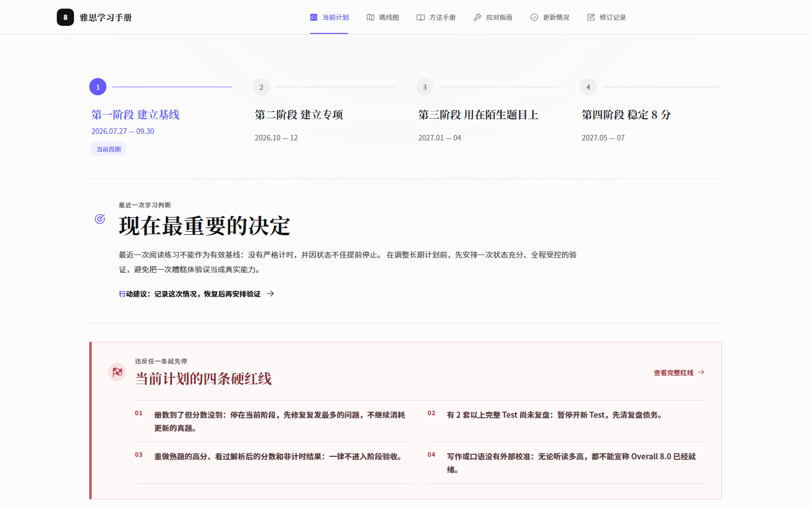
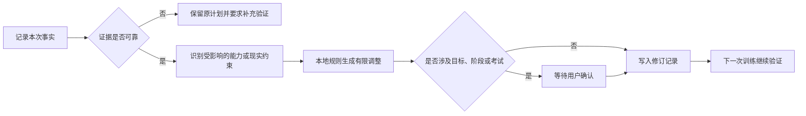

# 雅思学习手册

[](https://github.com/wuw039060-art/ielts-adaptive-handbook/actions/workflows/pages.yml)

[在线演示](https://wuw039060-art.github.io/ielts-adaptive-handbook/) · [提交与部署说明](docs/GITHUB_SUBMISSION_GUIDE.md) · [安全与隐私说明](SECURITY.md)

一个面向长期备考的个性化 IELTS 学习规划网站。它不承担在线做题和题库分发，而是把学习计划、训练方法、阶段验收、异常处理和修订记录放在同一个系统里，帮助学习者根据真实证据持续调整接下来一年的安排。

## 项目初衷

这个项目来自一个很具体的问题：如果一个人准备拿出一年时间学习 IELTS，真正困难的往往不是找不到资料，而是资料太多、方法彼此重叠，长期计划又很容易被课程、实习、身体状态、情绪波动和一次偶然成绩打乱。

市面上的课程、词汇书、真题解析和经验总结各有擅长的部分。有的体系更会解释听力声音识别，有的更擅长阅读定位，有的强调写作论证，有的提供口语训练流程。但把所有资料从头学一遍并不会自然形成能力，反而容易把时间花在收集资源、研究方法和反复制定计划上。

因此，这个项目没有继续增加一套课程，而是尝试完成三件更基础的工作：

1. **提炼共同原理**：把不同体系中真正有效的部分还原为声音识别、意义处理、快速检索、受约束表达和反馈修正等可训练能力。
2. **建立个人路线**：根据学习者的基础、可用时间、目标分数和现实限制，决定当前最值得解决的问题，而不是照搬一份普通学生模板。
3. **让计划持续演化**：每次训练后只记录必要事实，通过可靠证据判断方法是否有效，再对近期任务进行有限调整；不因为一天状态差推翻长期目标，也不因为一次高分提前宣布完成。

它最终想解决的不是“今天去哪做题”，而是下面这个长期问题：

> 当个人能力、时间安排和外部情况不断变化时，怎样让一份学习计划仍然贴合真实需要，并一直陪伴学习者走到目标成绩。

## 它刻意不做什么

这个网站不是在线雅思做题平台。用户不需要把完整真题、答案或受版权保护的材料录入系统，也不会在这里完成整套考试。训练仍然发生在合法取得的真题和学习材料中；网站只接收结果、错因、感受和现实约束，并负责回答“下一步应该怎样学”。

这种定位也避免了两个偏差：

- 不把“录入了多少题、刷完了多少册”误认为能力提升；
- 不让庞大的题库功能挤占规划、复盘、方法验证和长期适配这些真正核心的部分。

## 它要解决的关键问题

普通备考计划往往只规定“今天做什么”，很少回答下面几个问题：

- 什么时候才算真正掌握，而不是完成了任务？
- 一次分数波动、状态不好或进度落后时，计划应该怎样调整？
- 学习资料很多时，如何只保留当前最有价值的训练？
- 如何让 AI 提供帮助，同时不让模型随意改变目标和阶段？

本项目把计划视为一个需要不断验证的工作系统。每次更新先记录事实，再判断证据是否可靠，最后只修改受影响的部分；目标分数、阶段晋级和考试决策仍由用户确认。

| 学习中的现实问题 | 系统怎样处理 |
| --- | --- |
| 一次成绩突然下降 | 先区分能力、状态、计时和题型陌生，不直接降低目标 |
| 因懒惰或启动困难落后 | 缩小启动动作并保留最低接触，不把全部欠账搬到第二天 |
| 课程、工作或突发事务太多 | 重新估算未来两周容量，冻结加餐和新资料，保留主攻与复测 |
| 长期努力但成绩停滞 | 只更换一个训练变量，用同条件复测判断方法是否有效 |
| 心态受挫或压力过高 | 先进入可逆的恢复安排，状态稳定后再使用成绩作判断 |
| AI 给出激进建议 | 模型只能整理证据，目标、阶段、任务和考试决定仍由规则与用户控制 |



## 核心功能

- **当前计划**：自动识别日期，显示本月任务、最低执行版本、验收标准和不能跨过的红线。
- **阶段路线图**：按月展开一年的训练安排，并用分数、正确题数、外部校准和完成证据决定是否进入下一阶段。
- **方法手册**：覆盖听力、阅读、写作、口语和词汇，说明常见问题、处理步骤、有效性验证和停止条件。
- **情况更新**：记录成绩、时间、健康、心态和执行问题；本地规则会给出范围受限的调整建议。
- **修订记录**：保存每次建议的输入、依据和状态，避免新计划直接覆盖历史。
- **可选 AI 分析**：AI 只负责整理用户输入和标记风险，不能自行修改目标、阶段或任务。
- **本地加密配置**：API 配置使用 PBKDF2-SHA-256 派生密钥，并以 AES-GCM 加密；解锁密码不保存。
- **离线单文件**：构建时会额外生成可直接打开的单文件 HTML，便于本地长期使用。

## 调整逻辑



系统优先处理健康和基本状态，其次是可用时间、证据可靠性、方法有效性，最后才考虑阶段变化。一次低分不会直接降低长期目标；进度落后也不会把全部欠账搬到第二天。

## 技术实现

- React 19 + Vite
- 纯前端、响应式界面，可在桌面和移动浏览器使用
- Web Crypto API：PBKDF2-SHA-256 + AES-256-GCM
- localStorage：保存加密配置、用户修订记录和界面状态
- Node.js 内置测试框架：验证加密配置、输入约束、调整规则和 Worker 接口
- GitHub Actions：持续测试、构建并部署 GitHub Pages

## 本地运行

环境要求：Node.js 20 或更高版本、pnpm 10。

```bash
pnpm install --frozen-lockfile
pnpm run dev
```

浏览器打开终端显示的本地地址。完整检查：

```bash
pnpm run check
```

构建结果位于：

- `dist/client/`：标准静态网站，可部署到 GitHub Pages；
- `dist/雅思学习手册.html`：无需服务器即可打开的单文件版本。

## GitHub Pages

仓库已包含自动部署工作流。代码推送到 `main` 后，在 GitHub 仓库的 **Settings → Pages** 中将 Source 设为 **GitHub Actions**，随后可通过以下形式访问：

```text
https://wuw039060-art.github.io/ielts-adaptive-handbook/
```

详细的首次提交步骤见 [docs/GITHUB_SUBMISSION_GUIDE.md](docs/GITHUB_SUBMISSION_GUIDE.md)。

## 数据与隐私

- 仓库不会上传 `.env`、API 密钥、OpenAI 托管项目编号、构建日志或本地 QA 文件。
- 公开版本使用匿名学习画像，只描述能力强弱和可用时间类型，不包含真实姓名、学校、申请方向、具体考试成绩或个人日程。
- 不要为了演示效果把真实成绩、学校、实习单位、联系方式或完整学习记录提交到公开仓库。
- 浏览器保存的是密文，不是明文 API Key；解锁后，密钥仍会短暂存在于当前页面内存中。
- GitHub Pages 是静态演示环境。部分 API 服务不允许浏览器跨域直连；生产环境应使用受控后端代理，并把密钥放在服务端机密存储中。
- 清除浏览器站点数据会删除本地修订记录和加密配置。需要换设备时，应先导出加密配置并妥善保存解锁密码。

更多边界和报告方式见 [SECURITY.md](SECURITY.md)。

## 内容边界

这个仓库只包含学习方法、计划规则和界面代码，不包含 IELTS 书籍、剑桥真题原文、答案、音频、PDF 或其他受版权保护的训练材料。使用者需要自行通过合法渠道获取考试材料。

## 当前限制

- 学习数据主要保存在单一浏览器，尚未提供账户同步。
- 写作和口语分数仍需要可靠的外部校准，系统不能代替正式评分。
- 本地规则能处理预设情况，但不能替代医疗、心理或升学专业建议。
- AI 输出只作为辅助信息；模型失败或返回不合规内容时，系统保留原计划。

## 仓库结构

```text
src/                 页面、数据、调整规则和加密配置
tests/               自动化测试
worker/              可选的服务端适配接口
scripts/             构建 GitHub Pages 与单文件版本
.github/workflows/   CI 和 GitHub Pages 自动部署
docs/                提交与展示说明
```

## 许可证

当前仓库尚未附带开源许可证。公开展示不等于允许他人复制、修改或再分发代码。如果你希望项目可被复用，请在发布前根据自己的意愿选择 MIT、Apache-2.0 或其他许可证。
